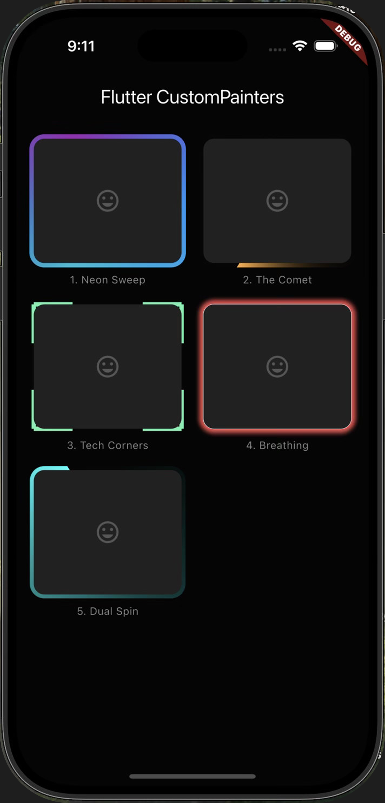

# ✨ Flutter CustomPainter Border Designs Showcase

A beautiful Flutter application showcasing **5 stunning animated border effects** built entirely with Flutter's `CustomPainter` API. No external packages required – just pure Flutter magic! 🎨



## 🎬 Demo

**Watch the live demo:** [https://streamable.com/vq3dsc](https://streamable.com/vq3dsc)

https://github.com/user-attachments/assets/demo_border_showcase.mov

---

## ✨ Features

This showcase demonstrates 5 unique animated border designs:

| # | Border Style | Description |
|---|-------------|-------------|
| 1 | **Neon Sweep** | A mesmerizing rotating gradient border with cyan, purple, and blue neon colors using `SweepGradient` |
| 2 | **The Comet** | A comet-like trailing effect with an orange accent that orbits around the card |
| 3 | **Tech Corners** | Futuristic animated corner brackets with pulsing length animation – perfect for sci-fi UIs |
| 4 | **Breathing** | A pulsing/breathing border effect with dynamic blur, opacity, and stroke width changes |
| 5 | **Dual Spin** | A spinning gradient border with cyan accent and smooth rotation |

---

## 🛠️ Tech Stack

- **Framework:** Flutter SDK ^3.10.4
- **Language:** Dart
- **Dependencies:** None (Pure Flutter – only uses `cupertino_icons` for icons)
- **Key APIs Used:**
  - `CustomPainter` – For drawing custom border graphics
  - `AnimationController` – For smooth, continuous animations
  - `SweepGradient` – For creating rotating gradient effects
  - `MaskFilter` – For blur effects on the breathing border

---

## 📁 Project Structure

```
CustomPainter_Border_Design/
├── README.md                          # This file
├── demo_border_showcase_image.png     # App screenshot
├── border_demo_showwcase.mov          # Demo video
└── frontend/                          # Flutter application
    ├── lib/
    │   └── main.dart                  # Main application code
    ├── pubspec.yaml                   # Flutter dependencies
    ├── android/                       # Android platform files
    ├── ios/                           # iOS platform files
    ├── web/                           # Web platform files
    ├── linux/                         # Linux platform files
    └── windows/                       # Windows platform files
```

---

## 🚀 Getting Started

### Prerequisites

- [Flutter SDK](https://docs.flutter.dev/get-started/install) (^3.10.4 or higher)
- A code editor (VS Code, Android Studio, etc.)
- An emulator/simulator or physical device

### Installation

1. **Clone the repository:**
   ```bash
   git clone https://github.com/yourusername/CustomPainter_Border_Design.git
   cd CustomPainter_Border_Design/frontend
   ```

2. **Install dependencies:**
   ```bash
   flutter pub get
   ```

3. **Run the app:**
   ```bash
   flutter run
   ```

### Running on Specific Platforms

```bash
# Android
flutter run -d android

# iOS
flutter run -d ios

# Web
flutter run -d chrome

# Desktop (macOS/Linux/Windows)
flutter run -d macos
flutter run -d linux
flutter run -d windows
```

---

## 💡 Code Highlights

### CustomPainter Implementation

The app uses a single `_UniversalBorderPainter` class that handles all 5 border types:

```dart
class _UniversalBorderPainter extends CustomPainter {
  final double animationValue;
  final BorderType type;

  @override
  void paint(Canvas canvas, Size size) {
    switch (type) {
      case BorderType.neonSweep:
        // Rotating SweepGradient with neon colors
        paint.shader = SweepGradient(
          colors: [Colors.cyan, Colors.purple, Colors.blue, Colors.cyan],
          transform: GradientRotation(animationValue * 2 * pi),
        ).createShader(rect);
        break;
      // ... other border types
    }
  }
}
```

### Animation Controller

Each card uses a `SingleTickerProviderStateMixin` with a repeating animation:

```dart
_controller = AnimationController(
  vsync: this, 
  duration: const Duration(seconds: 3)
)..repeat();
```

---

## 📱 Supported Platforms

| Platform | Status |
|----------|--------|
| Android  | ✅ Supported |
| iOS      | ✅ Supported |
| Web      | ✅ Supported |
| macOS    | ✅ Supported |
| Linux    | ✅ Supported |
| Windows  | ✅ Supported |

---

## 🎯 Use Cases

- **Learning Resource:** Perfect for understanding Flutter's `CustomPainter` API
- **UI Inspiration:** Use these border designs in your own projects
- **Component Library:** Extract and customize individual border styles
- **Portfolio Piece:** Showcase Flutter animation capabilities

---

## 📄 License

This project is open source and available under the [MIT License](LICENSE).

---

## 🤝 Contributing

Contributions are welcome! Feel free to:

1. Fork the repository
2. Create a feature branch (`git checkout -b feature/new-border-style`)
3. Commit your changes (`git commit -m 'Add new border style'`)
4. Push to the branch (`git push origin feature/new-border-style`)
5. Open a Pull Request

---

## 📧 Contact

If you have any questions or suggestions, feel free to open an issue or reach out!

---

<p align="center">
  Made with ❤️ using Flutter
</p>
